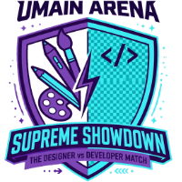

# Umain Arena

[](https://www.kimi.com/)
[](LICENSE)
[](https://astro.build)



Browser FPS in Three.js: a CS 1.6-style sniper arena (`awp_map`) where Designers
take on Developers. 100% fictional characters, no gore — just playful, exaggerated
role personas.

> 📝 This game was generated from scratch by AI (Kimi K3) from a single prompt —
> [read the original prompt in PROMPT.md](PROMPT.md).

## Credits

Umain Arena is a rebrand based on the original project
**"CS BRASIL: Treta Suprema"** by [@rubenmarcus](https://github.com/rubenmarcus)
— [github.com/rubenmarcus/csbrasil](https://github.com/rubenmarcus/csbrasil).

## Architecture

Monorepo with two zones:

- **Game** (`public/` — the site's `/` route) — vanilla JS + vendored Three.js,
  **zero build**: runs on its own with any static server. Never becomes a framework.
- **Site** (root, [Astro](https://astro.build)) — landing `/`, `/personagens`,
  `/como-jogar` (real SEO/AEO) + **SSR API routes** (`/api/*`) for the global
  ranking: the Supabase `service_role` key stays on the server, never in the browser.

## Run locally

Just the game (zero dependencies):

```bash
cd public
python3 -m http.server 8123
# open http://localhost:8123
```

Full site (landing + game at `/game/` + API):

```bash
git clone https://github.com/jacksonfdam/umain-arena.git
cd umain-arena
npm install
npm run fetch-audio   # audio pack (optional — without it, runs with synthesized sounds)
npm run dev           # Astro dev server
npm run build         # builds dist/ (client + server)
npm run preview       # serves dist/client statically
```

## Controls

| Key | Action |
| --- | --- |
| W A S D | Move |
| Mouse | Aim |
| Shift | Sprint |
| **Ctrl or C** | **Crouch — steadier aim** |
| Space | Jump |
| Left click | Shoot |
| Right click | AWP scope |
| R | Reload |
| 1 / 2 / 3 | AWP / Pistol / Knife |
| **Z / X / V** | **CS-style radio (voice commands)** |
| **M** | **Switch team (any time)** |
| Tab | Scoreboard |
| Esc | Pause |

**Rules:** 4v4 with respawn (2.5s). Rounds last 1:39; the team with the most kills
wins the round; first to 3 rounds wins. The AWP kills in one shot; headshots have
their own sound. Multikills trigger Unreal Tournament-style announcements. Set your
**nick** in the main menu (it's saved, with local stats on the RANKING screen).

## Audio (`public/audio/` folder)

The game loads `audio/manifest.json`:

```
audio/
  manifest.json        # track map (edit when adding files)
  designers/ingame/    # Designers team lines (radio + kill celebration)
  designers/round/     # plays when the Designers win the round
  developers/ingame/   # Developers team lines
  developers/round/    # plays when the Developers win the round
  game/                # UT announcements + weapon sounds (awp, usp, knife, clips)
  cs/                  # OPTIONAL: drop-in for your own sounds (see LEIA-ME.txt)
  manifest.example.json  # reference manifest (versioned in git)
```

- **Kill/death:** on a kill, plays a random line from the killer's team (3.5s throttle).
- **Radio (Z/X/V + 1-3):** plays a random line from your team and shows it in the HUD.
- **End of round:** plays the winning team's `round/` track.
- **Player multikills:** `doublekill` (2), `triplekill` (3), `multikill` (4),
  `megakill` (5), `godlike` (6+); 5 kills without dying = `killingspree`;
  headshot = `headshot`.
- **Adding tracks:** copy the file into the folder and register the path in
  `audio/manifest.json` (same keys). Without a manifest, the game uses synthesized sounds.
- **Generating voice lines:** `scripts/gen-voice.sh "your line" [out.mp3]` synthesizes
  a neutral team voice line (macOS `say` + `lame`). It asks only the **tone**
  (normal/grave/agudo/animado/calmo) and whether the voice is **male**. Skip the
  prompts with env vars for batches, e.g. `TOM=4 MASC=s scripts/gen-voice.sh "Ship it!"`.

### Audio pack (open source)

The `audio/` folder is **not versioned** (`.gitignore`) because the voices/clips
have uncertain rights — the public repo ships only the code (MIT). To get the pack:

```bash
# with the AUDIO_PACK_URL env pointing to the zip (default: this repo's Release audio-pack-v1)
bash scripts/fetch-audio.sh
```

- **Contributors**: run the script (or assemble their own folder following
  `manifest.example.json`). Without the files, the game uses synthesized sounds.
- **Create/update the pack**: `cd public/audio && zip -r ../../../../audio-pack.zip . -x '*.DS_Store'`

### About "real" CS 1.6 sounds

A CS 1.6-style AWP sound is already configured (`audio/game/awp-cs-1-6.mp3`).
The original CS 1.6 samples are **property of Valve** and are not distributed with
this game. If you own the game legally, you can use your own files: copy them from
`cstrike/sound/` to `audio/cs/` and register them in the manifest under the `"cs"` key.

## Global ranking (Supabase)

- **Phase 1 (current):** nick + social link and stats in `localStorage` (in-game RANKING screen).
- **Phase 2:** schema ready in `supabase/schema.sql` (players with UUID token, RPC
  `register_player`/`submit_match`, RLS, rate limit, `leaderboard` view).
  The SSR endpoints `GET /api/leaderboard` and `POST /api/submit-match` are already
  in the site — they go live once the `SUPABASE_URL` + `SUPABASE_SERVICE_ROLE_KEY`
  envs (server only!) are configured in the Vercel project.
- **Phase 3 (future):** Supabase Auth (magic link / OAuth) replaces the local token.

## SEO / AEO

Astro landing with meta/OG/canonical + `VideoGame` JSON-LD, visible FAQ,
`robots.txt`, `sitemap.xml` and `llms.txt` in `public/`. The game (`/game/`) has
its own optimized head + `FAQPage` JSON-LD.

## Structure

```
astro.config.mjs    Astro 7 + Vercel adapter (SSR endpoints)
vercel.json         build (fetch-audio + astro build) + cache headers
src/
  layouts/Layout.astro   shell (nav, footer, global CSS)
  pages/sobre.astro      landing/FAQ (VideoGame JSON-LD)
  pages/personagens.astro
  pages/como-jogar.astro
  pages/api/leaderboard.ts    GET ranking (service key on the server)
  pages/api/submit-match.ts   POST match (per-IP rate limit + RPC)
  lib/supabase.ts        admin client (SUPABASE_URL/SERVICE_ROLE_KEY envs)
public/               THE GAME on the / route (vanilla, zero build)
  index.html style.css js/ vendor/ audio/
  og-image.png robots.txt sitemap.xml llms.txt
scripts/fetch-audio.sh   downloads the audio pack to public/audio/
supabase/schema.sql      ranking schema (Phase 2)
```

## Swapping placeholders for real assets

- **Models:** characters are assembled in `public/js/characters.js`
  (`buildCharacter`). For GLTF, load the model in `mkBot`
  (`public/js/game.js`) and adapt `poseCharacter`.
- **Textures:** everything comes from `initTextures()` in `public/js/textures.js`.
- **Sounds:** see the Audio section above.
- **Map:** colliders are AABBs declared alongside each mesh in `public/js/map.js`.

## Licenses / credits

- Three.js r160 — MIT license (© Three.js authors), file in `public/vendor/`.
- Code, textures, characters and logo: original, procedurally generated.
- Audio in `audio/`: user-supplied content; verify rights before publishing
  commercially. CS 1.6 sounds **not included** (Valve).

*Fictional, playful fun. Made to laugh, not to fight.*
